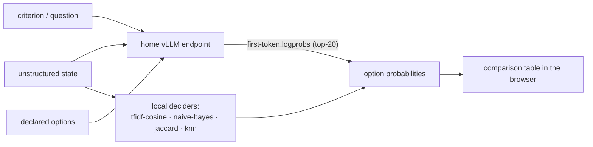
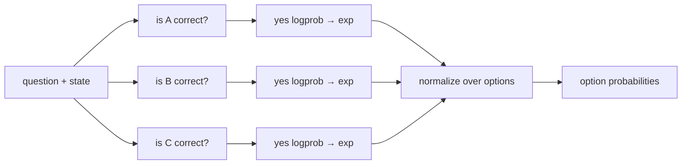

# low-level-decision-systems

Small decision harness: one runtime-defined question + unstructured evidence + a
list of options is scored by **six deciders at once**, and the results are
reported together for comparison. One of them is an LLM readout that imitates
[openjev](https://github.com/TheoLeeCJ/openjev) in minimal form over a served
endpoint; the others are local, no-training-data traditional-ML baselines.



- **Runtime-defined:** criterion and option descriptions arrive with the request; nothing is pre-trained per task.
- **Decision-native (LLM paths):** one forward pass per readout, no answer sentence generated, no JSON repair.
- **Local baselines need no data:** the runtime options themselves are the classes / neighbors — descriptions double as the training set.

## Quick start

```bash
uv sync                          # python 3.11+, deps: certifi, fastapi, scikit-learn, uvicorn
uv run python server.py          # serves http://127.0.0.1:8377
```

CLI (no web, no LLM required):

```bash
uv run python openjev_lite.py --input decisions.jsonl --output results.jsonl
```

The endpoint defaults to the `home-vllm` provider in `~/.pi/agent/models.json`
(same config the `hit-qwen-vllm.sh` probe reads). Override with
`JEV_MODELS_FILE`, `JEV_BASE_URL`, `JEV_API_KEY`, `JEV_MODEL`.

## Web app

`uv run python server.py` → open `http://127.0.0.1:8377`

- **Scenario list** (left) — loaded from the openjev examples in
  `decisions.jsonl`; click to load, `+ New scenario` to add your own.
- **Editor** (middle) — id, state (plain text, JSON object, or array),
  question, 2–16 options with letters A–P.
- **Result** (right) — comparison table: rows are options, columns are the six
  systems, per-column argmax highlighted, an agreement line against the LLM
  choice, per-system timings, and a raw-JSON toggle.

**Score this** runs all six deciders on the current scenario in one request.
**Score all scenarios** runs them over every saved scenario and collapses each
to one row showing every system's argmax + winning probability.

Or script it:

```bash
curl -X POST http://127.0.0.1:8377/api/score \
  -H 'Content-Type: application/json' \
  -d "$(head -1 decisions.jsonl)" \
| jq -r '.results | to_entries[] | "\(.key): \(.value.option_ids[(.value.probabilities | index(. | max))])"'
```

Validation errors return 422; endpoint failures return 502. A failing decider
reports its own error in its column — the other five still report.

## How the LLM readout works (the openjev imitation)

`openjev_lite.py` is direct-mode openjev over an API instead of a local GPU:

1. Build openjev's exact prompt: a fixed system prompt + one JSON payload
   `{"evidence": <state>, "criterion": <question>, "options": [{"letter": "A", "description": ...}]}`,
   model forced to answer with one uppercase letter A–P.
2. One `POST /chat/completions` with `max_tokens: 1, temperature: 0,
   logprobs, top_logprobs: 20, chat_template_kwargs: {enable_thinking: false}`.
   The thinking flag is required: the served model is a reasoning model and
   thinking tokens would poison the first-token readout.
3. Read each option letter's first-token logprob, softmax, emit the result
   (probabilities, option ids, timing, prompt hash, model metadata).

**One deviation from upstream, documented in the output:** openjev reads
full-vocabulary logits locally; this reads the served model's top-20 logprobs
(the endpoint's observed cap — it rejects `top_logprobs` above 20). A letter
outside the top-20 gets probability 0. Probabilities are conditional on the
supplied options and uncalibrated as confidence — same caveat openjev states.

## The six strategies

| # | system | type | what it measures |
|---|--------|------|------------------|
| 1 | `llm` | LLM | "which letter would I say first?" — direct option readout |
| 2 | `llm-per-option` | LLM | "how strongly do I affirm each option on its own?" |
| 3 | `tfidf-cosine` | local | cosine similarity of evidence+question vs each option description, `softmax(12·sim)` |
| 4 | `naive-bayes` | local | `MultinomialNB` fit on the option descriptions (3× per class), `predict_proba` on evidence+question |
| 5 | `jaccard` | local | keyword Jaccard overlap of evidence+question vs each option description, `softmax(20·sim)` |
| 6 | `knn` | local | `KNeighborsClassifier` (cosine, distance-weighted, k=min(3,n)) fit on option descriptions, `predict_proba` |

When there is no training data and no labels, "traditional ML" for
runtime-defined decisions reduces to two shapes: **options-as-classes** (fit a
classifier on the option descriptions) and **options-as-neighbors** (measure
similarity to the option descriptions). The local systems all compare the
*evidence+question* text against the *option description* texts — which is
exactly why they are sensitive to surface wording and diverge from the LLM on
intent-heavy questions.

### 1. `llm` — direct readout

One multi-choice prompt, all options as letters, one forward pass, read the
letter logprobs. Options compete in the same context; word overlap and option
ordering can bias the readout (that is the point of the comparison).

### 2. `llm-per-option` — pointwise binary scoring

Same model, same endpoint, different question. Each option is judged in
isolation with one binary question, and the model's "yes" is read as the
option's score:

```
system: Decide whether the supplied option is the correct answer for the
       criterion. Respond with exactly "yes" or "no".
user:   evidence: <state>
       criterion: <question>
       option: <option description>
```

Readout: first-token logprob of `yes` (thinking disabled), `exp()`, normalize
over options. The option requests run in parallel (4-wide thread pool), so
latency is ~one request, not N.



Why it diverges from `llm` (measured on `support-1`): the model answers the
pointwise question **no** for all three options (yes logprob −10.7 for `yes`,
−9.1 for `no`, −8.4 for `insufficient`) — the correct one included. The
ranking then comes from *which no is least decisive*: `insufficient`'s "yes"
was the least negative, so it wins at 64.4%. The two readouts measure
different things: **direct = "which letter would I say first?"**,
**per-option = "how strongly do I affirm each option on its own?"**

Caveats: the score is a yes-affinity, not P(option is correct); and if `yes`
is not in the top-20 logprobs for a confident "no" answer, that option scores
0 — a real failure mode of the readout.

### 3. `tfidf-cosine` — similarity

TF-IDF vectorize evidence+question and every option description, take the
cosine of the query against each option, `softmax(12·sim)`. The purest
"options-as-neighbors" baseline: no classifier at all, just which option
description the text looks most like.

### 4. `naive-bayes` — options-as-classes

Fit `MultinomialNB` on the option descriptions (each repeated 3× so the
classifier has word counts to work with; one doc per class leaves it nothing),
then `predict_proba` on evidence+question. A word-frequency classifier whose
entire training set is the options themselves.

### 5. `jaccard` — keyword overlap

Bag-of-words Jaccard overlap of evidence+question against each option
description, `softmax(20·sim)`. The simplest possible baseline — shared words
are the whole signal. The flattest probabilities of the group (the higher
softmax temperature is deliberate, to keep the distribution usable).

### 6. `knn` — nearest option, classified

`KNeighborsClassifier` with cosine metric and distance-weighted votes
(`k=min(3,n)`), fit on the option descriptions, `predict_proba` on
evidence+question. Like `tfidf-cosine` it lives in TF-IDF space, but it is a
genuine classifier with a learned decision boundary rather than a softmax over
raw similarity scores.

## Measured divergence (the point of the tool)

Live results from `decisions.jsonl` (one request runs all six):

```
support-1 (did the deployment succeed?)
  llm              yes             99.6%    304ms
  llm-per-option   insufficient   64.4%    726ms
  tfidf-cosine     yes             97.9%      2ms
  naive-bayes      yes             94.5%      2ms
  jaccard          yes             48.0%      0ms
  knn              yes             58.9%      3ms

route-1 (which queue handles a password reset?)
  llm              account_access  99.9%   1606ms
  llm-per-option   billing         82.0%    819ms
  tfidf-cosine     billing         42.9%      5ms
  naive-bayes      billing         34.7%      2ms
  jaccard          billing         33.8%      0ms
  knn              billing         34.5%      4ms

policy-1 (does this request need an approved change ticket?)
  llm              not_required    99.0%    876ms
  llm-per-option   insufficient    64.4%    425ms
  tfidf-cosine     not_required    56.2%      2ms
  naive-bayes      not_required    53.6%      2ms
  jaccard          not_required    66.4%      0ms
  knn              not_required    37.9%      3ms
```

`route-1` is the canonical case: the LLM reasons about intent
(`account_access`) while every text-matching system follows the surface
wording ("password reset" → `billing`) — even `llm-per-option` follows the
words here (82% `billing`). That is the divergence the comparison exists to
expose: the local systems match words, the LLM reads intent.

## Honest limits

- **Top-20 logprob truncation (LLM paths):** an option letter outside the
  top-20 scores 0; openjev's local readout has no such truncation.
- **Uncalibrated everywhere:** every probability here is a conditional option
  score, not a calibrated confidence. Calibrate on a workload with labels
  before using any of these to make real decisions.
- **Local systems are zero-shot by construction:** no external data is used or
  available; the option descriptions are the entire signal. They are
  baselines for comparison, not production classifiers.

## Files

| file | role |
|------|------|
| `openjev_lite.py` | the openjev direct-mode imitation over the endpoint (CLI + library) |
| `ml_systems.py` | the six-decider protocol: `score_all(row, endpoint)` |
| `server.py` | FastAPI: `/` (page), `/api/score`, `/api/examples`, `/api/info` |
| `web/index.html` | the whole UI — vanilla HTML/CSS/JS, no build step |
| `decisions.jsonl` | the three openjev example scenarios |
| `hit-qwen-vllm.sh` | the original endpoint probe (curl) |
| `hello.py` | uv project scaffold, unused by the tool |
