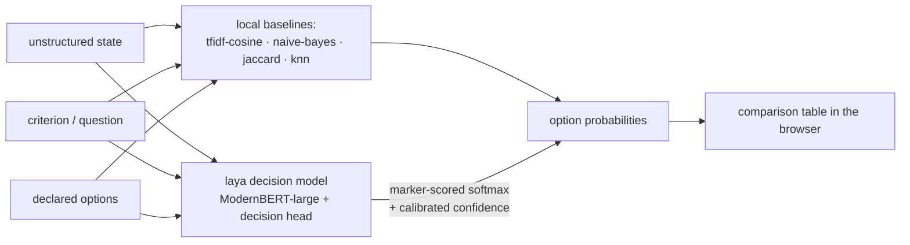

# low-level-decision-systems

Small decision harness: one runtime-defined question + unstructured evidence + a
list of options is scored by **five deciders at once**, and the results are
reported together for comparison. The base method is a small fully
fine-tuned non-autoregressive decision model
([`laya`](https://huggingface.co/convaiinnovations/laya), local,
temperature-calibrated, reports a calibrated confidence); the other four are
local, no-training-data traditional-ML baselines. The interface pattern is a
minimal imitation of
[openjev](https://github.com/TheoLeeCJ/openjev) — itself a reproduction of
TypeSafe's [Jev](https://typesafe.ai/blog/introducing-system-one-models-and-jev)
"System One" readout: unstructured state in, typed option probabilities out.



- **Runtime-defined:** criterion and option descriptions arrive with the request; nothing is pre-trained per task.
- **Decision-native (laya):** one forward pass per row, no answer sentence generated, no JSON repair — option probabilities are read straight out of the decision head.
- **Local baselines need no data:** the runtime options themselves are the classes / neighbors — descriptions double as the training set.

## Quick start

```bash
uv sync                          # python 3.11+, deps: certifi, fastapi, laya, scikit-learn, uvicorn
uv run python server.py          # serves http://127.0.0.1:8377
```

The `laya` model is a one-time, somewhat slow load, so the server pre-warms it
in a background thread at startup: the page (and `/health`) are ready well
before the model finishes, and the header chip tracks its state
(`loading…` / `ready` / error). A scoring request that lands while the load is
in flight simply waits for the already-loading agent — no double load.

Or script it:

```bash
curl -X POST http://127.0.0.1:8377/api/score \
  -H 'Content-Type: application/json' \
  -d "$(head -1 decisions.jsonl)" \
| jq -r '.results | to_entries[] | "\(.key): \(.value.option_ids[(.value.probabilities | index(. | max))])"'
```

Validation errors return 422; a failing decider reports its own error in its
column — the other four still report.

## Web app

`uv run python server.py` → open `http://127.0.0.1:8377`

- **Scenario list** — loaded from the openjev examples in
  `decisions.jsonl`; click to load, `+ New scenario` to add your own.
- **Result** — comparison table: rows are options, columns are the five
  systems (`laya` first), per-column argmax highlighted, an agreement line
  against the `laya` choice, per-system timings (plus laya's calibrated
  confidence), and a raw-JSON toggle. A header chip shows the local `laya`
  model's status (`loading…` / `ready` / error).

**Score this** runs all five deciders on the current scenario in one request.
**Score all scenarios** runs them over every saved scenario and collapses each
to one row showing every system's argmax + winning probability.

## openjev-lite — a standalone openjev imitation (optional)

`openjev_lite.py` is openjev's direct mode over an OpenAI-compatible chat
endpoint instead of a local GPU — a standalone CLI + library, **not** one of
the web app's deciders (the server only borrows its `validate_row` for
request validation):

```bash
uv run python openjev_lite.py --input decisions.jsonl --output results.jsonl
```

How the readout works:

1. Build openjev's exact prompt: a fixed system prompt + one JSON payload
   `{"evidence": <state>, "criterion": <question>, "options": [{"letter": "A", "description": ...}]}`,
   model forced to answer with one uppercase letter A–P.
2. One `POST /chat/completions` with `max_tokens: 1, temperature: 0,
   logprobs, top_logprobs: 20, chat_template_kwargs: {enable_thinking: false}`.
   The thinking flag is required: the served model is a reasoning model and
   thinking tokens would poison the first-token readout.
3. Read each option letter's first-token logprob, softmax, emit the result
   (probabilities, option ids, timing, prompt hash, model metadata).

Endpoint defaults come from the `home-vllm` provider in
`~/.pi/agent/models.json` (same config the `hit-qwen-vllm.sh` probe reads);
override with `JEV_MODELS_FILE`, `JEV_BASE_URL`, `JEV_API_KEY`, `JEV_MODEL`.

**One deviation from upstream, documented in the output:** openjev reads
full-vocabulary logits locally; this reads the served model's top-20 logprobs
(the endpoint's observed cap — it rejects `top_logprobs` above 20). A letter
outside the top-20 gets probability 0. Probabilities are conditional on the
supplied options and uncalibrated as confidence — same caveat openjev states.

## The five strategies

| # | system | type | what it measures |
|---|--------|------|------------------|
| 1 | `tfidf-cosine` | local | cosine similarity of evidence+question vs each option description, `softmax(12·sim)` |
| 2 | `naive-bayes` | local | `MultinomialNB` fit on the option descriptions (3× per class), `predict_proba` on evidence+question |
| 3 | `jaccard` | local | keyword Jaccard overlap of evidence+question vs each option description, `softmax(20·sim)` |
| 4 | `knn` | local | `KNeighborsClassifier` (cosine, distance-weighted, k=min(3,n)) fit on option descriptions, `predict_proba` |
| 5 | `laya` | local, fine-tuned | fully fine-tuned non-autoregressive decision model (ModernBERT-large + decision head), one choice question per row, marker-scored softmax over the option texts, temperature-calibrated; the only system that also reports a calibrated confidence |

When there is no training data and no labels, "traditional ML" for
runtime-defined decisions reduces to two shapes: **options-as-classes** (fit a
classifier on the option descriptions) and **options-as-neighbors** (measure
similarity to the option descriptions). The local systems all compare the
*evidence+question* text against the *option description* texts — which is
exactly why they are sensitive to surface wording and diverge from the
decision model on intent-heavy questions.

### 1. `tfidf-cosine` — similarity

TF-IDF vectorize evidence+question and every option description, take the
cosine of the query against each option, `softmax(12·sim)`. The purest
"options-as-neighbors" baseline: no classifier at all, just which option
description the text looks most like.

### 2. `naive-bayes` — options-as-classes

Fit `MultinomialNB` on the option descriptions (each repeated 3× so the
classifier has word counts to work with; one doc per class leaves it nothing),
then `predict_proba` on evidence+question. A word-frequency classifier whose
entire training set is the options themselves.

### 3. `jaccard` — keyword overlap

Bag-of-words Jaccard overlap of evidence+question against each option
description, `softmax(20·sim)`. The simplest possible baseline — shared words
are the whole signal. The flattest probabilities of the group (the higher
softmax temperature is deliberate, to keep the distribution usable).

### 4. `knn` — nearest option, classified

`KNeighborsClassifier` with cosine metric and distance-weighted votes
(`k=min(3,n)`), fit on the option descriptions, `predict_proba` on
evidence+question. Like `tfidf-cosine` it lives in TF-IDF space, but it is a
genuine classifier with a learned decision boundary rather than a softmax over
raw similarity scores.

### 5. `laya` — a small fully fine-tuned decision model (local)

[`laya`](https://huggingface.co/convaiinnovations/laya) is a 421M-parameter
non-autoregressive decision model (ModernBERT-large backbone + a small
decision head), fully fine-tuned with a strict proper scoring rule and
temperature-calibrated — not a general-purpose LLM and not a zero-shot
baseline. Each row becomes one `choice` question:

```
state:        <state>          question: <question>
options:      option id -> description   (each option at its own [MASK] marker)
```

One forward pass scores every option at its own `[MASK]` marker; the marker
logits go through a per-option-count temperature bucket and softmax into
probabilities over the option texts. It is the only decider that also
returns a calibrated **confidence** (normalized-entropy), shown in the
comparison table.

Practical notes:
- **Weights resolve by context.** Locally the harness loads laya from
  `models/laya/` (a self-contained ~808 MB copy, dereferenced real files,
  ignored by git) — so once it exists, no HuggingFace fetch ever happens
  again. If the folder is absent (a fresh checkout) it falls back to the
  HF repo id `convaiinnovations/laya` and downloads into the cache. In the
  deployed container the model is fetched once into the persistent `/data`
  volume on first boot and reused across restarts. Populate the local folder
  once with:
  `uv run python -c "from huggingface_hub import snapshot_download; snapshot_download('convaiinnovations/laya', local_dir='models/laya')"`
- **One-time per-process load.** Loading in a fresh process is slow (minutes
  on the Apple-Silicon GPU even with local weights; slower still on CPU), so
  the server pre-warms it in a background thread at startup and the first
  request simply waits for the already-loading agent (no double load); the
  header chip shows `loading…` / `ready`. Steady-state prediction is fast
  (~80–220 ms warm locally, ~70–160 ms on the deployed 2-core CPU box).
- **Truncation.** laya caps each question at 512 tokens (head maxLen 128);
  very long state or options get truncated.

## Measured divergence (the point of the tool)

support-1 (did the deployment succeed?)
  laya             yes             72.0%     74ms  conf 28.8%
  tfidf-cosine     yes             97.9%      2ms
  naive-bayes      yes             94.5%      2ms
  jaccard          yes             48.0%      0ms
  knn              yes             58.9%      4ms

route-1 (which queue handles a password reset?)
  laya             account_access  86.8%     88ms  conf 56.2%
  tfidf-cosine     billing         42.9%      2ms
  naive-bayes      billing         34.7%      2ms
  jaccard          billing         33.8%      0ms
  knn              billing         34.5%      3ms

policy-1 (does this request need an approved change ticket?)
  laya             not_required    65.0%    157ms  conf 21.3%
  tfidf-cosine     not_required    56.2%      2ms
  naive-bayes      not_required    53.6%      2ms
  jaccard          not_required    66.4%      0ms
  knn              not_required    37.9%      5ms

`route-1` is the canonical case: `laya` reasons about intent
(`account_access`) while every text-matching system follows the surface
wording ("password reset" → `billing`). That is the divergence the comparison
exists to expose: the local systems match words, the decision model reads
intent.

## Honest limits

- **Uncalibrated except laya:** every probability here is a conditional option
  score, not a calibrated confidence — *except* `laya`, which is
  temperature-calibrated and reports a normalized-entropy confidence.
  Calibrate the others on a workload with labels before using any of these to
  make real decisions.
- **Local systems are zero-shot by construction:** no external data is used or
  available; the option descriptions are the entire signal. They are
  baselines for comparison, not production classifiers.
- **laya truncates:** 512 tokens per question (head maxLen 128); very long
  state or options get truncated before scoring.

## Files

| file | role |
|------|------|
| `ml_systems.py` | the five-decider protocol: `score_all(row)`, incl. `laya` (lazy load + prewarm) |
| `server.py` | FastAPI: `/` (page), `/health`, `/api/score`, `/api/examples`, `/api/info`, `/api/laya` |
| `web/index.html` | the whole UI — vanilla HTML/CSS/JS, no build step |
| `openjev_lite.py` | standalone openjev direct-mode imitation over a chat endpoint (CLI + library; the server only borrows `validate_row`) |
| `decisions.jsonl` | the three openjev example scenarios |
| `hit-qwen-vllm.sh` | standalone endpoint probe (curl); not used by the app |
| `models/laya/` | the local laya weights (git-ignored); loaded in place, never re-fetched |
| `hello.py` | uv project scaffold, unused by the tool |
